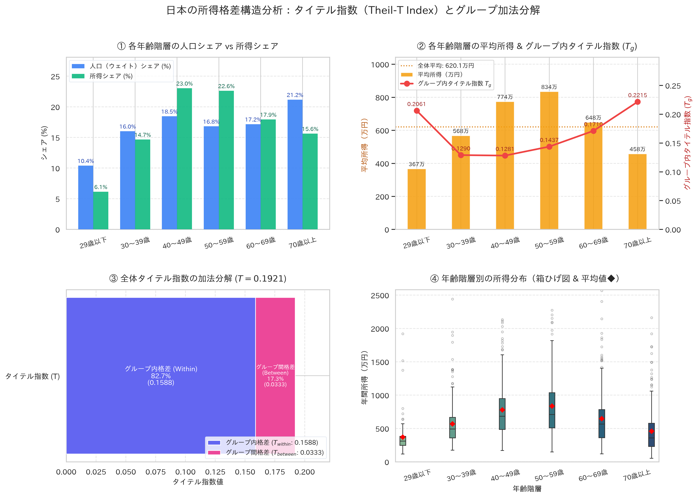

# 日本の所得格差分析：タイテル指数（Theil-T Index）とグループ加法分解

> ⚡ **本分析コードおよびWebレポートは Google Antigravity (AGY) により自律的に作成・検証されました。**

本リポジトリは、日本の所得・家計統計を模したマイクロデータを用いて、<strong>タイテル指数（Theil-T Index）</strong>およびその<strong>グループ内格差（Within-group）</strong>と<strong>グループ間格差（Between-group）</strong>への完全加法分解を行うPythonコードと分析結果を提供します。

- **Webレポート (GitHub Pages):** [http://katzkawai.org/kklab-inequality-agy/](http://katzkawai.org/kklab-inequality-agy/)（または [`docs/index.html`](./docs/index.html)）
- **学術解説論文 (PDF):** [解説論文を読む (LuaLaTeX / jlreq: `docs/theil_paper.pdf`)](./docs/theil_paper.pdf)
  - 著者: **河合 勝彦**（名古屋市立大学大学院経済学研究科, `kkawai@econ.nagoya-cu.ac.jp`）


---

## 1. 分析結果の要約

- **全体タイテル指数 ($T$):** `0.1921`
- **グループ内格差 ($T_{\text{within}}$):** `0.1588` （寄与率: **`82.7%`**）
- **グループ間格差 ($T_{\text{between}}$):** `0.0333` （寄与率: **`17.3%`**）
- **全体平均所得:** `620.1` 万円

---

## 2. 年齢階層別集計サマリー

| 年齢階層 | サンプル数 | 人口シェア ($p_g$) | 所得シェア ($s_g$) | 平均所得 (万円) | グループ内タイテル ($T_g$) | グループ内寄与 ($s_g T_g$) | グループ間寄与 ($s_g \ln \frac{\mu_g}{\mu}$) |
|:---|---:|---:|---:|---:|---:|---:|---:|
| 29歳以下 | 150 | 10.4% | 6.1% | 366.6 | 0.2061 | 0.0127 (6.6%) | -0.0323 (-16.8%) |
| 30〜39歳 | 240 | 16.0% | 14.7% | 567.5 | 0.1290 | 0.0189 (9.8%) | -0.0130 (-6.8%) |
| 40〜49歳 | 285 | 18.5% | 23.0% | 773.9 | 0.1281 | 0.0295 (15.4%) | 0.0510 (26.6%) |
| 50〜59歳 | 270 | 16.8% | 22.6% | 834.2 | 0.1437 | 0.0325 (16.9%) | 0.0671 (34.9%) |
| 60〜69歳 | 255 | 17.2% | 17.9% | 648.1 | 0.1710 | 0.0307 (16.0%) | 0.0079 (4.1%) |
| 70歳以上 | 300 | 21.2% | 15.6% | 457.6 | 0.2215 | 0.0346 (18.0%) | -0.0475 (-24.7%) |
| **全体合計** | **1,500** | **100.0%** | **100.0%** | **620.1** | **-** | **0.1588 (82.7%)** | **0.0333 (17.3%)** |

---

## 3. 可視化ダッシュボード



---

## 4. 実行方法 (PEP 723 / uv)

本スクリプトは [PEP 723 (Inline script metadata)](https://peps.python.org/pep-0723/) に準拠しています。`uv` を用いて依存関係を自動解決して直接実行できます。

```bash
uv run calculate_theil.py
```

---

## 5. データの出典・統計的背景

本リポジトリで使用されている家計データは、日本の所得格差構造を再現するため、以下の公的統計調査の公表データ・分布パラメータを参考に統計的手法（対数正規分布 + パレートテール + 抽出ウェイト）により生成された合成データ（Synthetic Dataset, $N=1,500$）です。

1. **厚生労働省「国民生活基礎調査」**（所得票・各種世帯の所得等の状況）
2. **総務省統計局「家計調査」**（家計収支編・貯蓄・負債編）
3. **総務省「就業構造基本調査」**（雇用形態別・所得分布データ）

---

## 6. 免責事項（Disclaimer）

本リポジトリで提供される分析コード、計算ロジック、可視化グラフ、および解説は、タイテル指数（Theil-T Index）の加法分解手法を実証・解説するための研究・教育・技術デモを目的としています。使用しているデータは統計的手法により生成されたシミュレーションデータ（合成データ）であり、実在する個人・世帯の実測値そのものではありません。本コンテンツの正確性・完全性・有用性等についてはいかなる保証も行いません。本情報の利用により生じた直接的・間接的な損害について、作成者および関係者は一切の責任を負いません。
